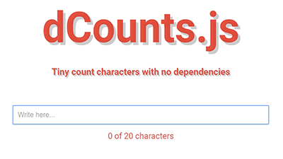

# dCounts-js
> Tiny count characters with no dependencies




## How to use:

### Installation

**Using npm:**
`npm install dcounts-js --save`

**Manually:** Download **_dcounts-js.min.js_** from this repo and add before the closing body tag:

```html
<script src="path/to/dcounts-js.min.js">
```
**Usage:**

```js
dcounts('selector', limit);
```
where **_selector_** _input_ or _textarea_ is a ID and _**limit**_ is a number.

**Full Example:**

```html
...
<input id="my_input_text" type="text" />
...
    <script src="path/to/dcounts-js.min.js"></script>

    <script>
      dcounts('my_input_text', 20); //without #
    </script>
  </body>
</html>
```

## LICENSE

&copy; [MIT](LICENSE) License
